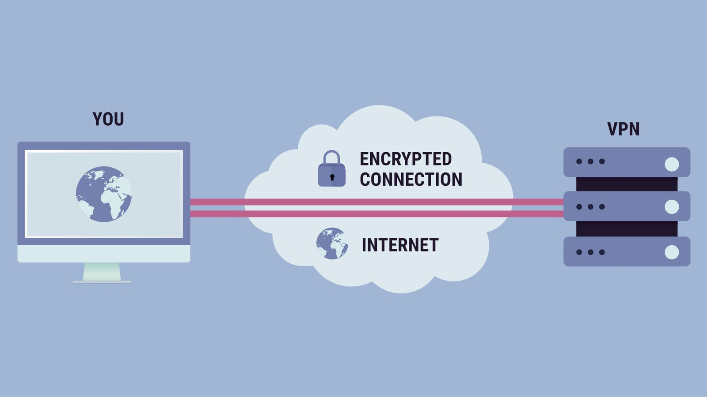
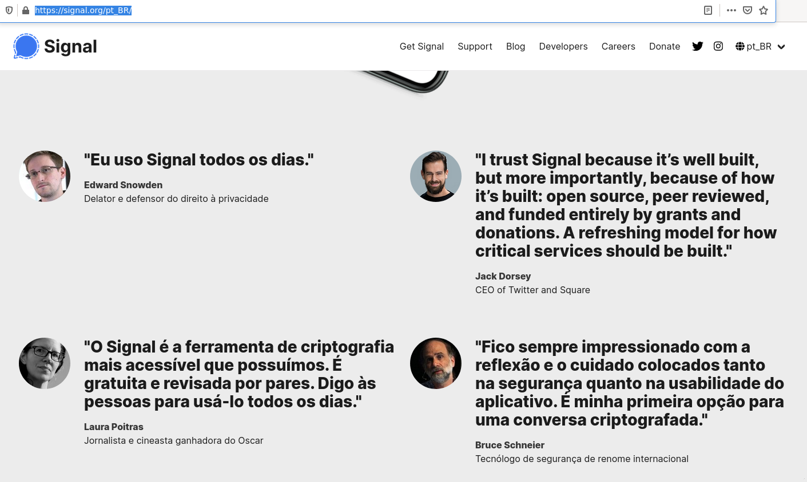

## Privacidade e direitos na rede
### Sobre a talk
Aqui irei abordar formas de burlar a vigilancia governamental e corporativa. Seja utilizando seu celular ou até seu computador.
O foco é para sistemas Android, Linux(Debian e derivados) e caso tenha outro sistema siga a referencia abaixo.
> https://prism-break.org/pt/

## Navegação segura
### O que é a rede Tor
O Tor Project é uma organização sem fins lucrativos que tem como os Estados Unidos. O objetivo do roteamento onion era ter uma forma de usar a internet com o máximo de privacidade possível, e a ideia era rotear o tráfego por múltiplos servidores e criptografá-lo a cada passo do caminho. Essa ainda é uma explicação simples para o funcionamento do Tor hoje.

Você pode ver mais sobre a historia do tor na pagina oficial.
> [Referencia e historia](https://www.torproject.org/pt-BR/about/history/)

#### Exemplo de uso
Com o Navegador Tor, a rede Tor tornou-se mais acessível a pessoas comuns na internet e a ativistas, o que fez do Tor uma ferramenta fundamental durante a Primavera Árabe no final de 2010. Ele não somente protegia a identidade das pessoas on-line como possibilitava o acesso a recursos fundamentais, a mídias sociais e a websites bloqueados.

### Tor Browser - navegação - Android
O Navegador Tor para Android é o único navegador móvel oficial compatível com o Projeto Tor, desenvolvedores da ferramenta mais poderosa do mundo para privacidade e liberdade online.

Pode ser realizado o download do instalador APK ou na google play.
> https://www.torproject.org/download/#android
> [Referencia e Download na Google Play](https://play.google.com/store/apps/details?id=org.torproject.torbrowser)
> [Download na F-Droid não disponivel](https://support.torproject.org/tormobile/tormobile-7/)

### Orbot - proxy - Android
O Orbot não funciona para dar mais segurança ou privacidade para a navegação. Ele apenas cria a conexão com o Tor e autoriza os aplicativos extras a serem usados.
> https://play.google.com/store/apps/details?id=org.torproject.android&hl=pt_BR&gl=US

### Onion Service - Criando sua comunidade
O Onion Service auxilia na criação de um serviço anonimo na rede onion, por exemplo, temos um serviço como um servidor web que funciona na porta 80/TCP, podemos redirecionar ele para a rede onion e assim gerando um site **.onion**.
> https://andrewlock.net/trying-out-the-open-source-ecommerce-platform-nopcommerce-using-docker/
> https://github.com/mybb/docker

### Outras Redes
Outra rede semelhante a tor é a I2P(Projeto Internet Invisível, com ela podemos ter um nivel de privacidade tambem, o problema é que ela não possui tantos usuario e casos de uso.
> https://geti2p.net/pt-br/

### Possiveis problemas
Já foi discutido com outros profissionais que as operadoras poderiam ter a visibilidade da rede tor, mas isso pode ser remediado usando uma VPN(Virtual Private Network) e assim criando um servidor em algum pais remediando medidas legais.

Dessa forma toda a sua conexão ira passar por um tunel e assim evitando ataques de man-in-the-middle. Em outras palavras interceptando a conexão e capturando informações.

Alem disso quando se usa uma VPN o seu endereço de IP é alterado para o do servidor e assim podemos ter a localização do mesmo.

## Lojas
Diferente de lojas como Google Play, Amazon appstore e Apple Store que são de propriedade de imperios da tecnologia, podemos usar lojas que usam aplicativos opensource e analisados por profissionais que se preocupam com a privacidade.

### F-droid
O **F-Droid** é um loja de software que tem como foco o Android, a loja contém apenas aplicativos gratuitos e de código aberto.

## Comunidades
### Riseup
O Riseup é um coletivo que possui diversos voluntários que possui diversos serviços, como por exemplo:
- e-mail seguro
- VPN
- Serviços on-line;
> https://riseup.net/pt

A organização foi criada por ativistas em Seattle em 1999 e a sua missão é lutar contra o controle social e vigilância em massa através da distribuição de ferramentas seguras.
> [Referencia](https://pt.wikipedia.org/wiki/Riseup)

### Cryptorave
A CryptoRave é um evento incrivel que acontece anualmente que discute temas como criptografia, segurança da informação e direitos digitais em São Paulo. Qualquer pessoa pode submeter sua palestra/oficina para compartilhar seu conhecimento de forma gratuita e é totalmente mantida por doações.

Site oficial:
> https://cryptorave.org/

## Base
Já imaginou a possibilidade de criar sua propria base de dados, armazenar repositorios de projetos e até enviar arquivos de forma anonima ? Tudo isso é possivel com os aplicativos que foi compartilhar abaixo.

### NextCloud
#### O que é o NextCloud?
O Nextcloud fornece uma solução para realizar a sincronização e compartilhamento de arquivos, isso respeitando a privacidade e é totalmente de código aberto.

Temos uma lista rica de aplicativos, incluindo Contatos, Calendário, Videochamadas, Mail, Leitor de Notícias e muito mais.

#### Como pode nos ajudar ?
O NextCloud vem para substituir o **G suite**, **Office 365** e **Zoho Office Suite**.

### Gitlab
Já pensou em compartilhar seus projetos, codigos fontes, imagens e até arquivos ? E ainda conseguindo versionar essas versões de forma segura e na sua propria infraestrutura ? Isso é possivel graças ao gitlab.

Temos uma versão disponivel web, mas o foco é a instalação em uma infraestrutura propria onde nós somos responsaveis pelos dados.

Versão online:
> https://gitlab.com/users/sign_in

Realização da instalação:
> https://about.gitlab.com/install/

### onionshare (PC)
#### O que é o onionshare ?
OnionShare é uma ferramenta de código aberto que permite que você compartilhe arquivos, hospede sites e converse com amigos de forma segura e anônima.

O site oficial é:
> https://onionshare.org/

A documentação é:
> https://docs.onionshare.org/2.4/en/

## Aplicativos comunicação
Diariamente nos comunicamos atraves de aplicativos de mensagens, atualmente temos diversos e muitos deles já tiveram problemas com coleta de informações. Alguns deles sao:
- Whatsapp
- Telegram
- Facebook
- Instagram

Mas dependendo das informações que são faladas pode ser um problema, a grande maioria por estar em paises onde a lei obriga a dar acesso as informações em caso de investigação e isso pode ser um risco.

### Signal - Android
O Signal é uma solução incrivel que nos auxilia na comunicação de forma segura e atualmente é apoiada por diversos profissionais. Com ela conseguimos receber mensagens de forma segura, participar de chamadas de voz e vídeo.

É um serviço de fácil utilização e resistente que usa metadados com chamadas de áudio/vídeo.

> https://signal.org/pt_BR/

Um ponto bem interessante é o uso de mensagens temporarias onde conseguimos autodestruir as mensagens e assim evitando a coleta de informações sensiveis.

### OFTC (IRC)
> https://www.oftc.net/

## Rede Social
### diaspora
### kolabnow
> https://kolabnow.com

## documentos
### Planilhas
#### Ethercalc
> https://ethercalc.net
> https://prism-break.org/pt/projects/ethercalc/

## Extensões para navegadores
### Noscript
### ublock

## Moedas
### Bitcoin
Bitcoin é uma nova moeda digital experimental que permite pagamento instantâneo para qualquer pessoa, em qualquer lugar do mundo. Bitcoin usa tecnologia peer-to-peer (P2P) para operar sem autoridade central: a gerência de transações e a emissão de dinheiro é executada coletivamente pela rede. Bitcoin Core é o nome do softwareopen source que habilita o uso desta moeda.

Leia mais em:
> [Bitcoin para desenvolvedores](https://itsrio.org/wp-content/uploads/2018/06/bitcoin-para-programadores.pdf)

Documentação oficial:
> https://bitcoin.org/bitcoin.pdf

### Monero

## Criação de persona
### O que são personas ?
Personas são personagens fictícios criados para representar os diferentes tipos de usuário dentro de um alvo demográfico, atitude e/ou comportamento definido que poderia utilizar um site, uma marca ou produto de um modo similar.

### 4devs
O 4devs é um projeto web que pode nos ajudar na geração de dados ficticios, dessa forma podemos evitar o uso dos nossos dados em sistemas que não temos a necessidade de usar. Veja mais no link abaixo:
> https://www.4devs.com.br/gerador_de_pessoas

Nesse exemplo estou realizando a criação de uma pessoa, mas podemos criar diversas com diversos dados.

Podemos escolher diversas informações e são:
- Sexo
- Idade
- Estado
- Gerar dados com pontuação

### Face generation
Podemos gerar uma imagem de um rosto usando inteligencia artificial, dessa forma não infringimos nenhuma lei ou usamos a imagem de uma determinada pessoa.

Alguns projetos que podemos utilizar.
> https://generated.photos/face-generator/new
> https://techunwrapped.com/create-and-download-random-faces-that-dont-exist-based-on-ai/

## Mundo
### Privacidade china
Atualmente a cesura da china é algo comentado no mundo inteiro, alem disso existe uma grande vigilancia governamental. Um projeto muito interessante é o **Projeto Escudo Dourado** que é chamado tambem de **Grande Firewall da China**, é um projeto de vigilância e de censura operado pela divisão do Ministério da Segurança Pública (MSP) do governo chinês.

O projeto teve início em 1998 e começou suas operações em novembro de 2003.[2]
> https://pt.wikipedia.org/wiki/Projeto_Escudo_Dourado

Alem disso o pais tem uma grande vigilancia de cameras, isso porque lá tudo isso é avaliado e monitorado pelo governo. Isso gerou diversos protesto no pais e assim dando grande visibilidade desse problema ao mundo.
Video incrivel de um protesto:
> https://twitter.com/alessabocchi/status/1156513770254012416
> [Noticia olhar digital](https://olhardigital.com.br/2019/08/01/noticias/manifestantes-usam-laser-contra-cameras-de-reconhecimento-facial/)

Mas esses projetos inspirou outros governos, como o de São Paulo que implementou um grande sistema de vigilancia. Bauru tambem possui um sistema assim. Mas felizmente não captura suas informações correlanciando com informações pessoais e só são usadas para segurança publica.

### ByPass Security cam
A vigilancia não é só na internet e em nossas ligações. Como vimos em alguns paises a vigilancia de cameras é um grande problema. Mas a corrida entre a privacidade e a vigilancia é constante.

Abaixo podemos ver alguns projetos de oculos ou até pinturas no rosto para evitar a captura de imagens.

Por exemplo:
- Oculos refletivos
> Graças à iniciativa de Scott Urban, um pequeno empresário dos EUA, nasceu a ideia de ‘Reflectacles’, um par de óculos de reconhecimento facial. Por exemplo, o modelo Reflectacles Ghost é capaz de refletir as luzes invisíveis e infravermelhas projetadas contra o rosto do usuário, de modo que as câmeras que funcionam com essa tecnologia não serão capazes de registrar as características do rosto do usuário.

> https://hackaday.com/2020/02/28/using-ir-leds-to-hide-in-plain-sight/
> https://www.securitynewspaper.com/2019/07/18/8-methods-for-bypassing-surveillance-cameras-and-facial-recognition-software/
